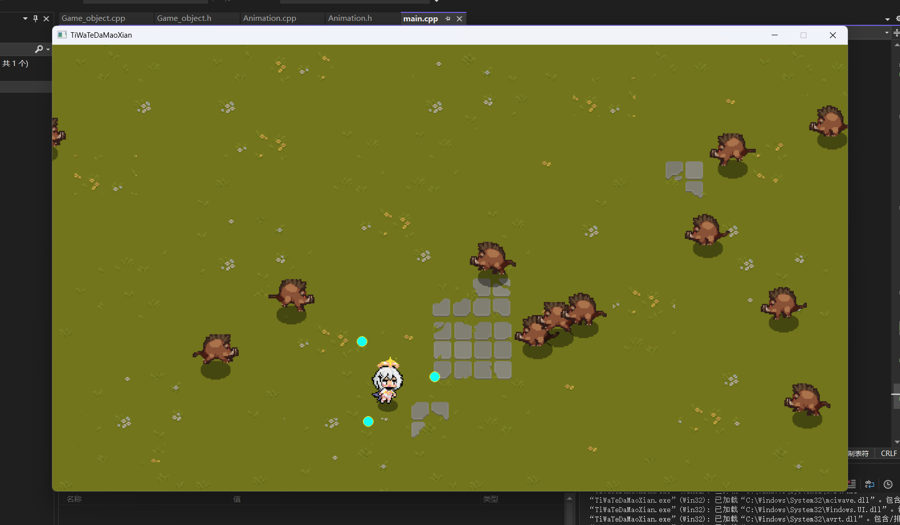

# 采用EasyX图形库实现的简单割草游戏

### 项目简介
* 本人也在学习游戏开发过程中的小白
* 项目所有的素材资源和思路参考了B站up主：
[【从零开始的C++游戏开发】全宇宙最简单的类吸血鬼幸存者游戏开发 | EasyX制作提瓦特幸存者] : https://www.bilibili.com/video/BV1eM4m1S74K/?spm_id_from=333.1387.homepage.video_card.click&vd_source=e3da77497fe99f91206ee64c180aa42f

* ps:Voidmatrix yyds QWQ

## 环境
* Windows 10 64位
* Visual Studio 2022
* EasyX图形库
* C++17

## 游戏运行图片

## 项目有点乱，还没来得及整理O.o